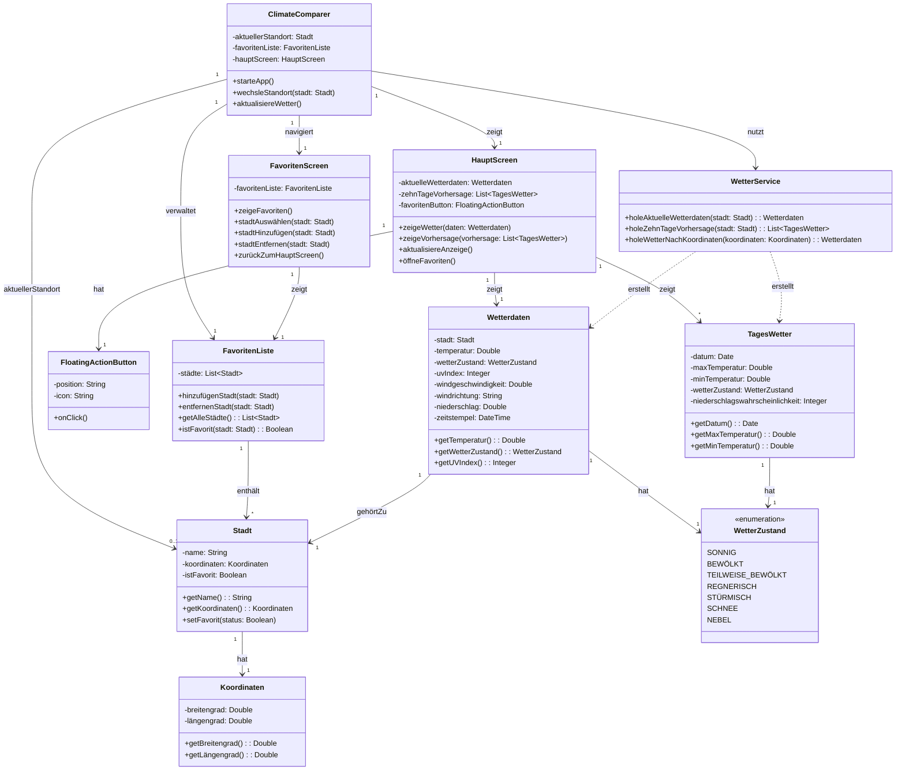

# ☁️ ClimateComparer

**Deine smarte Wetter-App mit Favoritenfunktion, Standortwetter und stilvollem UI – gebaut mit Jetpack Compose, Clean Architecture und ganz viel ☀️🌧️❄️.**

---

## 📚 Inhaltsverzeichnis

1. [🚀 Ziel der App](#-ziel-der-app)
2. [📊 UML-Diagramm](#-uml-diagramm)
3. [🖼️ Features](#️-features)
4. [🏗️ Architektur](#️-architektur)
5. [🔌 API & Datenquellen](#-api--datenquellen)
6. [🧪 Testing](#-testing)
7. [🛠️ Technologien](#️-technologien)

---

## 🚀 Ziel der App

ClimateComparer soll eine minimalistische und intuitive Wetter-App werden, die dir nicht nur das Wetter an deinem aktuellen Standort zeigt, sondern auch eine Vergleichsmöglichkeit über deine Lieblingsstädte bietet. Zusätzlich gibt’s eine Wetterradar-Ansicht, Stundenprognosen und eine elegante Benutzeroberfläche.

---

## 📊 UML-Diagramm

---

## 🖼️ Features

- 📍 Standortbasiertes aktuelles Wetter
- ❤️ Favoritenliste (Städte hinzufügen & verwalten)
- 🕒 Stunden- & Tagesprognosen
- 📊 UV-Index und Windgeschwindigkeit
- 🗺️ Wetterradar-Ansicht (Map)
- 🔎 Suchfunktion für Städte
- 💾 Lokale Datenhaltung (z. B. Room oder DataStore geplant)

---

## 🏗️ Architektur

Wir setzen auf eine klare Trennung von Verantwortlichkeiten mit Fokus auf **Clean Architecture**, **MVVM** und **Domain-Driven Design**:

---

## 🔌 API & Datenquellen

- 🌐 [OpenWeatherMap API](https://openweathermap.org/api) (für Wetter, Forecast, UV Index)
- 📦 Retrofit2 für API-Anbindung
- 🔐 API-Key wird lokal abgesichert via `.env` (nicht committed)

---

## 🧪 Testing

- ✅ Unit-Tests für UseCases
- 🧪 Mocked Repositories für ViewModel-Tests
- 🔍 Komponententests für Screens (geplant)

---

## 🛠️ Technologien

- 🧑‍💻 Kotlin
- 🧱 Jetpack Compose
- 🧪 Retrofit2
- 🔀 Coroutine Flow / StateFlow
- 🧩 Clean Architecture
- 📦 Hilt (oder Koin) für Dependency Injection
- 🔍 JUnit + MockK für Tests

---

> ✨ _“There’s no such thing as bad weather – only wrong apps.”_
